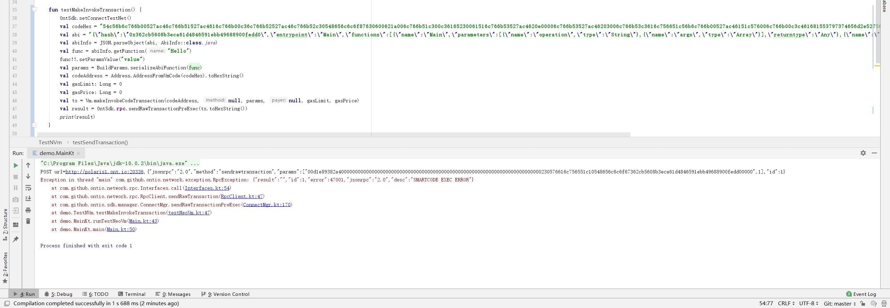
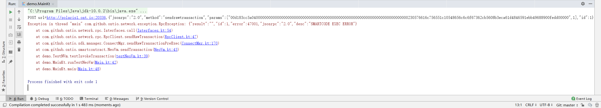
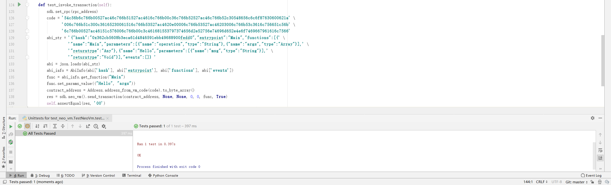

# ontology-kotlin-sdk NeoVm Testing

<!-- TOC -->

- [ontology-kotlin-sdk NeoVm Testing](#ontology-kotlin-sdk-neovm-testing)
    - [Overview](#overview)
    - [sendRawTransaction](#sendrawtransaction)
        - [Test Code](#test-code)
        - [Test Result](#test-result)
    - [makeDeployCodeTransaction](#makedeploycodetransaction)
        - [Test Code](#test-code)
        - [Test Result](#test-result)
    - [MakeInvokeTransaction](#makeinvoketransaction)
        - [Test Code](#test-code)
        - [Test Smart Contract](#test-smart-contract)
        - [Test Result](#test-result)
    - [sendTransaction](#sendtransaction)
        - [Test Code](#test-code)
        - [Test Smart Contract](#test-smart-contract)
        - [Test Result](#test-result)

<!-- /TOC -->

## Overview

- :egg: 表示在`ontology-kotlin-sdk`中未找到对应的接口。

- :hatching_chick:表示在`ontology-kotlin-sdk`中有对应接口，但可能存在不完善的地方。 

- :hatched_chick: 表示在`ontology-kotlin-sdk`中存在完全对应接口。

| Result           |                             |
| :--------------: | :-------------------------: |
| :hatched_chick:  | sendRawTransaction()        |
| :hatched_chick:  | makeDeployCodeTransaction() |
| :hatching_chick: | MakeInvokeTransaction()     |
| :hatching_chick: | sendTransaction             |

## sendRawTransaction

### Test Code

```Kotlin
fun testSendTransaction() {
    OntSdk.setConnectTestNet()
    val privateKey = "523c5fcf74823831756f0bcb3634234f10b3beb1c05595058534577752ad2d9f"
    val account = Account(Helper.hexToBytes(privateKey), SignatureScheme.SHA256WITHECDSA)
    val codeHex = "54c56b6c766b00527ac46c766b51527ac4616c766b00c36c766b52527ac46c766b52c30548656c6c6f87630600621a006c766b51c300c36165230061516c766b53527ac4620e00006c766b53527ac46203006c766b53c3616c756651c56b6c766b00527ac46151c576006c766b00c3c461681553797374656d2e52756e74696d652e4e6f7469667961616c7566"
    val codeAddress = Address.AddressFromVmCode(codeHex).toHexString()
    val tx = Vm.makeDeployCodeTransaction(codeHex, true, "name", "v1.0", "author", "email", "desp", account.addressU160.toBase58(), 20000000, 500)
    OntSdk.signTx(tx, arrayOf(arrayOf(account)))
    val result = OntSdk.rpc.sendRawTransaction(tx.toHexString())
    print("sendRawTransaction: ")
    println(result)
    Thread.sleep(6000)
    val contract = OntSdk.rpc.getContract(codeAddress)
    print("Contract: ")
    println(contract)
}
```

### Test Result

```bash
POST url=http://polaris1.ont.io:20336,{"jsonrpc":"2.0","method":"sendrawtransaction","params":["00d038e53cabf401000000000000002d3101000000004756c9dd829b2142883adbe1ae4f8689a1f673e98d54c56b6c766b00527ac46c766b51527ac4616c766b00c36c766b52527ac46c766b52c30548656c6c6f87630600621a006c766b51c300c36165230061516c766b53527ac4620e00006c766b53527ac46203006c766b53c3616c756651c56b6c766b00527ac46151c576006c766b00c3c461681553797374656d2e52756e74696d652e4e6f7469667961616c756601046e616d650476312e3006617574686f7205656d61696c0464657370000142410102dae82655c6b1845fb72ad21fca0528dee4436040deab5a817f5e0295c3a3bc909c110ede6815a93b697344ae0011a6f97ab9ee8a05be006889c98cbeee9432232103036c12be3726eb283d078dff481175e96224f0b0c632c7a37e10eb40fe6be889ac"],"id":1}
sendRawTransaction: true
POST url=http://polaris1.ont.io:20336,{"jsonrpc":"2.0","method":"getcontractstate","params":["362cb5608b3eca61d4846591ebb49688900fedd0",1],"id":1}
Contract: {"NeedStorage":true,"Email":"XXX@XXXX.com","Description":"Hello World","CodeVersion":"1.0","Author":"Tester","Code":"54c56b6c766b00527ac46c766b51527ac4616c766b00c36c766b52527ac46c766b52c30548656c6c6f87630600621a006c766b51c300c36165230061516c766b53527ac4620e00006c766b53527ac46203006c766b53c3616c756651c56b6c766b00527ac46151c576006c766b00c3c461681553797374656d2e52756e74696d652e4e6f7469667961616c7566","Name":"MyHello"}
```

## makeDeployCodeTransaction

### Test Code

```Kotlin
fun testMakeDeployTransaction() {
    OntSdk.setConnectTestNet()
    val privateKey = "523c5fcf74823831756f0bcb3634234f10b3beb1c05595058534577752ad2d9f"
    val payer = Account(Helper.hexToBytes(privateKey), SignatureScheme.SHA256WITHECDSA)
    val codeHex = "54c56b6c766b00527ac46c766b51527ac4616c766b00c36c766b52527ac46c766b52c30548656c6c6f87630600621a006c766b51c300c36165230061516c766b53527ac4620e00006c766b53527ac46203006c766b53c3616c756651c56b6c766b00527ac46151c576006c766b00c3c461681553797374656d2e52756e74696d652e4e6f7469667961616c7566"
    val codeAddress = Address.AddressFromVmCode(codeHex).toHexString()
    val gasLimit: Long = 20000000
    val gasPrice: Long = 500
    val b58Payer = payer.addressU160.toBase58()
    val tx = Vm.makeDeployCodeTransaction(codeHex, true, "name", "v1.0", "author", "email", "description", b58Payer, gasLimit, gasPrice)
    OntSdk.signTx(tx, arrayOf(arrayOf(payer)))
    val result = OntSdk.rpc.sendRawTransaction(tx.toHexString())
    print("DeployTransaction: ")
    println(result)
    Thread.sleep(6000)
    val contract = OntSdk.rpc.getContract(codeAddress)
    print("Contract: ")
    println(contract)
}
```

### Test Result

```bash
POST url=http://polaris1.ont.io:20336,{"jsonrpc":"2.0","method":"sendrawtransaction","params":["00d00d68af9ef401000000000000002d310100000000d2c124dd088190f709b684e0bc676d70c41b37768d54c56b6c766b00527ac46c766b51527ac4616c766b00c36c766b52527ac46c766b52c30548656c6c6f87630600621a006c766b51c300c36165230061516c766b53527ac4620e00006c766b53527ac46203006c766b53c3616c756651c56b6c766b00527ac46151c576006c766b00c3c461681553797374656d2e52756e74696d652e4e6f7469667961616c756601046e616d650476312e3006617574686f7205656d61696c0b6465736372697074696f6e00014241010a585152c4aecfdf45747d3a120ece582e1a9e8c2e9ce2fbaad6511fcb71cccbb8aa5549d052bbb1af30c243d4475e59d0d02bf497180fd593b1b969386616372321035384561673e76c7e3003e705e4aa7aee67714c8b68d62dd1fb3221f48c5d3da0ac"],"id":1}
DeployTransaction: true
POST url=http://polaris1.ont.io:20336,{"jsonrpc":"2.0","method":"getcontractstate","params":["362cb5608b3eca61d4846591ebb49688900fedd0",1],"id":1}
Contract: {"NeedStorage":true,"Email":"XXX@XXXX.com","Description":"Hello World","CodeVersion":"1.0","Author":"Tester","Code":"54c56b6c766b00527ac46c766b51527ac4616c766b00c36c766b52527ac46c766b52c30548656c6c6f87630600621a006c766b51c300c36165230061516c766b53527ac4620e00006c766b53527ac46203006c766b53c3616c756651c56b6c766b00527ac46151c576006c766b00c3c461681553797374656d2e52756e74696d652e4e6f7469667961616c7566","Name":"MyHello"}
```

## MakeInvokeTransaction

### Test Code

```Kotlin
fun testMakeInvokeTransaction() {
    OntSdk.setConnectTestNet()
    val codeHex = "54c56b6c766b00527ac46c766b51527ac4616c766b00c36c766b52527ac46c766b52c30548656c6c6f87630600621a006c766b51c300c36165230061516c766b53527ac4620e00006c766b53527ac46203006c766b53c3616c756651c56b6c766b00527ac46151c576006c766b00c3c461681553797374656d2e52756e74696d652e4e6f7469667961616c7566"
    val abi = "{\"hash\":\"0x362cb5608b3eca61d4846591ebb49688900fedd0\",\"entrypoint\":\"Main\",\"functions\":[{\"name\":\"Main\",\"parameters\":[{\"name\":\"operation\",\"type\":\"String\"},{\"name\":\"args\",\"type\":\"Array\"}],\"returntype\":\"Any\"},{\"name\":\"Hello\",\"parameters\":[{\"name\":\"msg\",\"type\":\"String\"}],\"returntype\":\"Void\"}],\"events\":[]}"
    val abiInfo = JSON.parseObject(abi, AbiInfo::class.java)
    val func = abiInfo.getFunction("Hello")
    func!!.setParamsValue("value")
    val params = BuildParams.serializeAbiFunction(func)
    val codeAddress = Address.AddressFromVmCode(codeHex).toHexString()
    val gasLimit: Long = 0
    val gasPrice: Long = 0
    val tx = Vm.makeInvokeCodeTransaction(codeAddress, null, params, null, gasLimit, gasPrice)
    val result = OntSdk.rpc.sendRawTransactionPreExec(tx.toHexString())
    print(result)
}
```

### Test Smart Contract

```c#
using Ont.SmartContract.Framework.Services.Ont;
using Ont.SmartContract.Framework;
using System;
using System.ComponentModel;

namespace Ont.SmartContract
{
    public class HelloWorld : Framework.SmartContract
    {
        public static object Main(string operation, params object[] args)
        {
            switch (operation)
            {
                case "Hello":
                    Hello((string)args[0]);
                    return true;
                default:
                    return false;
            }
        }
        public static void Hello(string msg)
        {
            Runtime.Notify(msg);
        }
    }
}
```

### Test Result

```bash
POST url=http://polaris1.ont.io:20336,{"jsonrpc":"2.0","method":"sendrawtransaction","params":["00d1e89382a4000000000000000000000000000000000000000000000000000000000000000000000000230576616c756551c10548656c6c6f67362cb5608b3eca61d4846591ebb49688900fedd00000",1],"id":1}
Exception in thread "main" com.github.ontio.network.exception.RpcException: {"result":"","id":1,"error":47001,"jsonrpc":"2.0","desc":"SMARTCODE EXEC ERROR"}
	at com.github.ontio.network.rpc.Interfaces.call(Interfaces.kt:54)
	at com.github.ontio.network.rpc.RpcClient.sendRawTransaction(RpcClient.kt:47)
	at com.github.ontio.sdk.manager.ConnectMgr.sendRawTransactionPreExec(ConnectMgr.kt:170)
	at demo.TestNVm.testMakeInvokeTransaction(testNeoVm.kt:47)
	at demo.MainKt.runTestNeoVm(Main.kt:43)
	at demo.MainKt.main(Main.kt:50)
```



## sendTransaction

### Test Code

```Kotlin
fun testInvokeTransaction() {
    OntSdk.setConnectTestNet()
    val codeHex = "54c56b6c766b00527ac46c766b51527ac4616c766b00c36c766b52527ac46c766b52c30548656c6c6f87630600621a006c766b51c300c36165230061516c766b53527ac4620e00006c766b53527ac46203006c766b53c3616c756651c56b6c766b00527ac46151c576006c766b00c3c461681553797374656d2e52756e74696d652e4e6f7469667961616c7566"
    val abi = "{\"hash\":\"0x362cb5608b3eca61d4846591ebb49688900fedd0\",\"entrypoint\":\"Main\",\"functions\":[{\"name\":\"Main\",\"parameters\":[{\"name\":\"operation\",\"type\":\"String\"},{\"name\":\"args\",\"type\":\"Array\"}],\"returntype\":\"Any\"},{\"name\":\"Hello\",\"parameters\":[{\"name\":\"msg\",\"type\":\"String\"}],\"returntype\":\"Void\"}],\"events\":[]}"
    val abiInfo = JSON.parseObject(abi, AbiInfo::class.java)
    val func = abiInfo.getFunction("Hello")
    func!!.setParamsValue("value")
    val codeAddress = Address.AddressFromVmCode(codeHex).toHexString()
    val result = NeoVm.sendTransaction(codeAddress, null, null, 0, 0, func, true)
    println(result)
}
```

### Test Smart Contract

```c#
using Ont.SmartContract.Framework.Services.Ont;
using Ont.SmartContract.Framework;
using System;
using System.ComponentModel;

namespace Ont.SmartContract
{
    public class HelloWorld : Framework.SmartContract
    {
        public static object Main(string operation, params object[] args)
        {
            switch (operation)
            {
                case "Hello":
                    Hello((string)args[0]);
                    return true;
                default:
                    return false;
            }
        }
        public static void Hello(string msg)
        {
            Runtime.Notify(msg);
        }
    }
}
```

### Test Result

```bash
POST url=http://polaris1.ont.io:20336,{"jsonrpc":"2.0","method":"sendrawtransaction","params":["00d1a861a4b1000000000000000000000000000000000000000000000000000000000000000000000000230576616c756551c10548656c6c6f67362cb5608b3eca61d4846591ebb49688900fedd00000",1],"id":1}
Exception in thread "main" com.github.ontio.network.exception.RpcException: {"result":"","id":1,"error":47001,"jsonrpc":"2.0","desc":"SMARTCODE EXEC ERROR"}
	at com.github.ontio.network.rpc.Interfaces.call(Interfaces.kt:54)
	at com.github.ontio.network.rpc.RpcClient.sendRawTransaction(RpcClient.kt:47)
	at com.github.ontio.sdk.manager.ConnectMgr.sendRawTransactionPreExec(ConnectMgr.kt:170)
	at com.github.ontio.smartcontract.NeoVm.sendTransaction(NeoVm.kt:43)
	at demo.TestNVm.testInvokeTransaction(testNeoVm.kt:39)
	at demo.MainKt.runTestNeoVm(Main.kt:42)
	at demo.MainKt.main(Main.kt:48)

Process finished with exit code 1
```

Kotlin SDK:



Python SDK:

