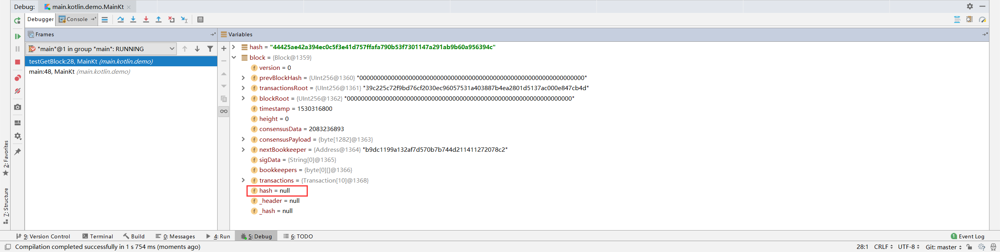
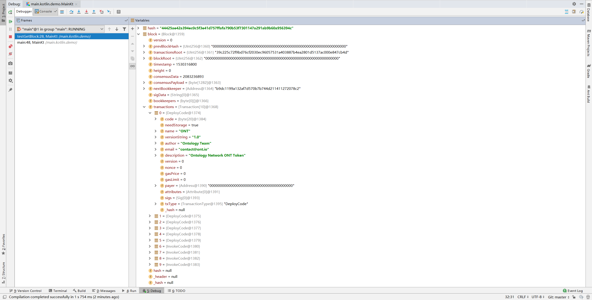
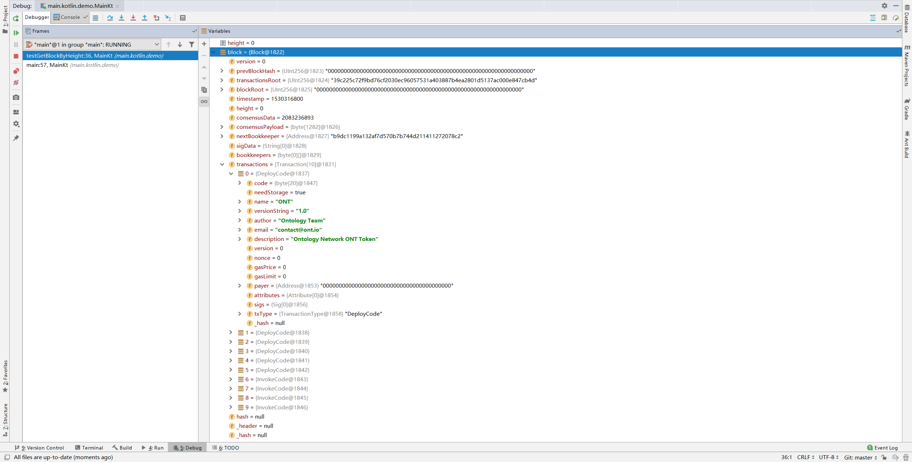

# ontology-kotlin-sdk RPC Testing

<!-- TOC -->

- [ontology-kotlin-sdk RPC Testing](#ontology-kotlin-sdk-rpc-testing)
    - [Overview](#overview)
    - [getVersion()](#getversion)
        - [Test Code](#test-code)
        - [Test Result](#test-result)
    - [getNodeCount()](#getnodecount)
        - [Test Code](#test-code)
        - [Test Result](#test-result)
    - [GetBlock()](#getblock)
        - [Test Code](#test-code)
        - [Test Result](#test-result)
    - [getBlockHeight()](#getblockheight)
        - [Test Code](#test-code)
        - [Test Result](#test-result)
    - [getBalance()](#getbalance)
        - [Test Code](#test-code)
        - [Test Result](#test-result)
    - [getAllowance](#getallowance)
        - [Test Code](#test-code)
        - [Test Result](#test-result)
    - [getStorage](#getstorage)
        - [Test Code](#test-code)
        - [Test Result](#test-result)
    - [getSmartCodeEvent()](#getsmartcodeevent)
        - [Test Code](#test-code)
        - [Test Result](#test-result)
    - [SendRawTransaction()](#sendrawtransaction)
        - [Test Code](#test-code)
        - [Test Result](#test-result)

<!-- /TOC -->

## Overview

- :egg: 表示在`ontology-kotlin-sdk`中未找到对应的接口。

- :hatching_chick:表示在`ontology-kotlin-sdk`中有对应接口，但可能存在不完善的地方。 

- :hatched_chick: 表示在`ontology-kotlin-sdk`中存在完全对应接口。

|      Result      |                     |
|:----------------:|:-------------------:|
|  :hatched_chick: |     getVersion()    |
|       :egg:      |     getGasPrice     |
|       :egg:      |     getNetworkId    |
| :hatching_chick: |      GetBlock()     |
|  :hatched_chick: |   getBlockHeight()  |
|  :hatched_chick: |     getBalance()    |
|  :hatched_chick: |     getAllowance    |
|  :hatched_chick: |      getStorage     |
|  :hatched_chick: | getSmartCodeEvent() |

## getVersion()

### Test Code

```Kotlin
fun testGetVersion() {
    OntSdk.setConnectTestNet()
    val version = OntSdk.rpc.getVersion()
    print("Version: ")
    println(version)
}
```

### Test Result

```bash
POST url=http://polaris1.ont.io:20336,{"jsonrpc":"2.0","method":"getversion","params":[],"id":1}
Version: v1.0.2
```

## getNodeCount()

### Test Code

```Kotlin
fun testGetNodeCount() {
    OntSdk.setConnectTestNet()
    val count = OntSdk.rpc.getNodeCount()
    print("NodeCount: ")
    println(count)
}
```

### Test Result

```bash
POST url=http://polaris1.ont.io:20336,{"jsonrpc":"2.0","method":"getconnectioncount","params":[],"id":1}
NodeCount: 14
```

## GetBlock()

### Test Code

```Kotlin
fun testGetBlockByHash() {
    OntSdk.setConnectTestNet()
    val hash = "44425ae42a394ec0c5f3e41d757ffafa790b53f7301147a291ab9b60a956394c"
    val block = OntSdk.rpc.getBlock(hash)
    print("Block: ")
    println(block)
}
```

```Kotlin
fun testGetBlockByHeight() {
    OntSdk.setConnectTestNet()
    val height = 0
    val block = OntSdk.rpc.getBlock(height)
    print("Block: ")
    println(block)
}
```

### Test Result

```bash
POST url=http://polaris1.ont.io:20336,{"jsonrpc":"2.0","method":"getblock","params":["44425ae42a394ec0c5f3e41d757ffafa790b53f7301147a291ab9b60a956394c"],"id":1}
Block: com.github.ontio.core.block.Block@a956394c
```





```bash
POST url=http://polaris1.ont.io:20336,{"jsonrpc":"2.0","method":"getblock","params":[0],"id":1}
Block: com.github.ontio.core.block.Block@a956394c
```



## getBlockHeight()

### Test Code

```Kotlin
fun testGetBlockHeight() {
    OntSdk.setConnectTestNet()
    val blockHeight = OntSdk.rpc.getBlockHeight()
    print("BlockHeight: ")
    println(blockHeight)
}
```

### Test Result

```bash
POST url=http://polaris1.ont.io:20336,{"jsonrpc":"2.0","method":"getblockcount","params":[],"id":1}
BlockHeight: 179851
```

## getBalance()

### Test Code

```Kotlin
fun testGetBalance() {
    OntSdk.setConnectTestNet()
    val b58Address = "AazEvfQPcQ2GEFFPLF1ZLwQ7K5jDn81hve"
    val balance = OntSdk.rpc.getBalance(b58Address)
    print("Balance: ")
    println(balance)
}
```

### Test Result

```bash
POST url=http://polaris1.ont.io:20336,{"jsonrpc":"2.0","method":"getbalance","params":["ANH5bHrrt111XwNEnuPZj6u95Dd6u7G4D6"],"id":1}
balance: {"ont":"890369","ong":"2382356658805"}
```

## getAllowance

### Test Code

```Kotlin
fun testSendRawTransaction() {
    OntSdk.setConnectTestNet()
    val privateKey = "523c5fcf74823831756f0bcb3634234f10b3beb1c05595058534577752ad2d9f"
    val payer = Account(Helper.hexToBytes(privateKey), SignatureScheme.SHA256WITHECDSA)
    val b58Payer = payer.addressU160.toBase58()
    val b58Recv = "AazEvfQPcQ2GEFFPLF1ZLwQ7K5jDn81hve"
    println("balance: " + OntSdk.rpc.getBalance(payer.addressU160.toBase58()))
    val transaction = Ont.makeTransfer(b58Payer, b58Recv, 1, b58Payer, 20000, 500)
    OntSdk.signTx(transaction, arrayOf(arrayOf(payer)))
    val result = OntSdk.rpc.sendRawTransaction(transaction)
    print("sendRawTransaction: ")
    println(result)
}
```

### Test Result

```bash
POST url=http://polaris1.ont.io:20336,{"jsonrpc":"2.0","method":"getallowance","params":["ont","ANH5bHrrt111XwNEnuPZj6u95Dd6u7G4D6","AazEvfQPcQ2GEFFPLF1ZLwQ7K5jDn81hve"],"id":1}
Allowance: 1
POST url=http://polaris1.ont.io:20336,{"jsonrpc":"2.0","method":"getallowance","params":["ong","ANH5bHrrt111XwNEnuPZj6u95Dd6u7G4D6","AazEvfQPcQ2GEFFPLF1ZLwQ7K5jDn81hve"],"id":1}
Allowance: 0
```

## getStorage

### Test Code

```Kotlin
fun testGetStorage() {
    OntSdk.setConnectTestNet()
    val contractAddress = "0100000000000000000000000000000000000000"
    val key = "746f74616c537570706c79"
    val value = OntSdk.rpc.getStorage(contractAddress, key)
    print("Storage: ")
    println(value)
}
```

### Test Result

```bash
POST url=http://polaris1.ont.io:20336,{"jsonrpc":"2.0","method":"getstorage","params":["0100000000000000000000000000000000000000","746f74616c537570706c79"],"id":1}
Storage: 00ca9a3b00000000
```

## getSmartCodeEvent()

### Test Code

```Kotlin
fun testGetSmartCodeEvent() {
    OntSdk.setConnectTestNet()
    val txHash = "65d3b2d3237743f21795e344563190ccbe50e9930520b8525142b075433fdd74"
    val eventByHash = OntSdk.rpc.getSmartCodeEvent(txHash)
    print("Event: ")
    println(eventByHash)
    val height = 0
    val eventByHeight = OntSdk.rpc.getSmartCodeEvent(height)
    print("Event: ")
    println(eventByHeight)
}
```

### Test Result

```bash
POST url=http://polaris1.ont.io:20336,{"jsonrpc":"2.0","method":"getsmartcodeevent","params":["65d3b2d3237743f21795e344563190ccbe50e9930520b8525142b075433fdd74"],"id":1}
Event: {"GasConsumed":0,"Notify":[],"TxHash":"65d3b2d3237743f21795e344563190ccbe50e9930520b8525142b075433fdd74","State":1}
POST url=http://polaris1.ont.io:20336,{"jsonrpc":"2.0","method":"getsmartcodeevent","params":[0],"id":1}
Event: [{"GasConsumed":0,"Notify":[],"TxHash":"65d3b2d3237743f21795e344563190ccbe50e9930520b8525142b075433fdd74","State":1},{"GasConsumed":0,"Notify":[],"TxHash":"e67e5c934dd165bec2156835e5af06696bc42cc14daa04a5846ebb7e60cc4701","State":1},{"GasConsumed":0,"Notify":[],"TxHash":"5d09b2b9ba302e9da8b9472ef10c824caf998e940cc5a73d7da16971d64c0290","State":1},{"GasConsumed":0,"Notify":[],"TxHash":"e492d21464c459f310656d66b1388622f81d5b1ebdb06ccb364f68145b2f1c26","State":1},{"GasConsumed":0,"Notify":[],"TxHash":"e6592dda267eec1867d61a5dd1f6ccbf23565a526da7a8230f5c5a27591d27de","State":1},{"GasConsumed":0,"Notify":[],"TxHash":"7842ed25e4f028529e666bcecda2795ec49d570120f82309e3d5b94f72d30ebb","State":1},{"GasConsumed":0,"Notify":[{"States":["transfer","AFmseVrdL9f9oyCzZefL9tG6UbvhPbdYzM","AZW8eBkXh5qgRjmeZjqY2KFGLXhKcX4i2Y",1000000000],"ContractAddress":"0100000000000000000000000000000000000000"}],"TxHash":"1ebde66ec3f309dad20a63f8929a779162a067c36ce7b00ffbe8f4cfc8050d79","State":1},{"GasConsumed":0,"Notify":[{"States":["transfer","AFmseVrdL9f9oyCzZefL9tG6UbvhPbdYzM","AFmseVrdL9f9oyCzZefL9tG6UbvhUMqNMV",1000000000000000000],"ContractAddress":"0200000000000000000000000000000000000000"}],"TxHash":"7e8c19fdd4f9ba67f95659833e336eac37116f74ea8bf7be4541ada05b13503e","State":1},{"GasConsumed":0,"Notify":[],"TxHash":"bf74e9208c0a20ec417de458ab6c9d29c12c614e77fb943be4566c95fab61454","State":1},{"GasConsumed":0,"Notify":[{"States":["initContractAdmin","0700000000000000000000000000000000000000","did:ont:AMAx993nE6NEqZjwBssUfopxnnvTdob9ij"],"ContractAddress":"0600000000000000000000000000000000000000"}],"TxHash":"12943957b10643f04d89938925306fa342cec9d32925f5bd8e9ea7ce912d16d3","State":1}]
```


## SendRawTransaction()

### Test Code

```Kotlin
fun testSendRawTransaction() {
    OntSdk.setConnectTestNet()
    val privateKey = "523c5fcf74823831756f0bcb3634234f10b3beb1c05595058534577752ad2d9f"
    val payer = Account(Helper.hexToBytes(privateKey), SignatureScheme.SHA256WITHECDSA)
    val b58Payer = payer.addressU160.toBase58()
    val b58Recv = "AazEvfQPcQ2GEFFPLF1ZLwQ7K5jDn81hve"
    println("balance: " + OntSdk.rpc.getBalance(payer.addressU160.toBase58()))
    val transaction = Ont.makeTransfer(b58Payer, b58Recv, 1, b58Payer, 20000, 500)
    OntSdk.signTx(transaction, arrayOf(arrayOf(payer)))
    val result = OntSdk.rpc.sendRawTransaction(transaction)
    print("sendRawTransaction: ")
    println(result)
}
```

### Test Result

```bash
POST url=http://polaris1.ont.io:20336,{"jsonrpc":"2.0","method":"sendrawtransaction","params":["00d1209a0135f401000000000000204e0000000000004756c9dd829b2142883adbe1ae4f8689a1f673e97100c66b144756c9dd829b2142883adbe1ae4f8689a1f673e96a7cc814d2c124dd088190f709b684e0bc676d70c41b37766a7cc8516a7cc86c51c1087472616e736665721400000000000000000000000000000000000000010068164f6e746f6c6f67792e4e61746976652e496e766f6b650001424101e0004ffb2841f3e35d8a8991c51ee613772e819393decf786e65575b28c3cdc71e136add7c3e2e1f755abac9272a7cbc36bf87be919fcb2d4741281e2d48b5e2232103036c12be3726eb283d078dff481175e96224f0b0c632c7a37e10eb40fe6be889ac"],"id":1}
sendRawTransaction: true
```